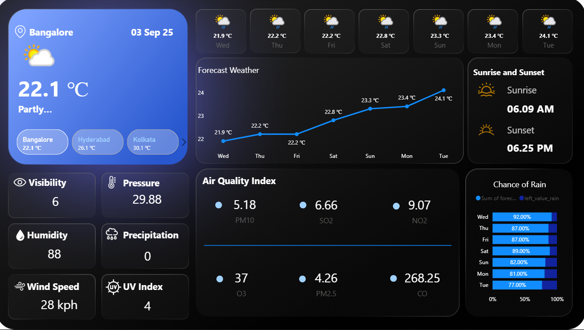

# Weather-Data-Visualization
# 🌤️ Weather Dashboard – Power BI  

An interactive and visually appealing **Power BI dashboard** built to track and analyze real-time weather conditions for multiple cities. This project leverages a **free Weather API** to fetch live data, transform it using Power Query, and visualize it dynamically in Power BI.

---

## 📜 Short Description / Purpose  
The **Weather Dashboard** provides real-time and forecasted weather information, air quality indices, and key environmental metrics for multiple cities. It helps users easily understand and compare weather patterns, air quality, and forecasts at a glance.

---

## 🛠️ Tech Stack  

This dashboard was built using the following tools and technologies:  

- 📊 **Power BI Desktop** – Main data visualization platform used for report creation  
- 📁 **Power Query** – Data transformation and cleaning layer for reshaping and preparing the API data  
- 🧠 **DAX (Data Analysis Expressions)** – Used for calculated measures, dynamic visuals, and conditional logic  
- 🗂️ **Data Modeling** – Relationships established between tables (weather data, forecast, air quality index) to enable cross-visual analysis  
- 📑 **File Format** – `.pbix` for development and `.png` for dashboard preview  

---

## 🌐 Data Source  

- **Weather API** (Free tier) – Used to fetch live weather and air quality data for multiple cities  
- Data was fetched via API calls, then transformed and cleaned using Power Query before being loaded into Power BI  

---

## ✨ Features / Highlights  

- **Real-Time Weather Conditions** – Temperature, humidity, pressure, wind speed, and UV index  
- **Forecast View** – 7-day weather forecast with dynamic trend line  
- **Air Quality Index** – PM10, SO2, NO2, O3, PM2.5, and CO levels displayed clearly  
- **Chance of Rain** – Probability visualized in an easy-to-read bar chart  
- **Sunrise & Sunset Times** – Quickly see daylight duration  

---

## 🧩 Business Impact & Insights  

This dashboard can be used by:  
- **Individuals** – To plan travel or daily activities based on weather forecasts  
- **Organizations** – To monitor air quality and environmental conditions in specific regions  
- **Developers** – As a template for API-driven Power BI dashboards  

---

## 📂 Repository Contents  

- `Weather_Dashboard.pbix` – Power BI report file  
- `Snapshot_of_Dashboard.png` – Preview image of the dashboard  
- `README.md` – Project documentation (this file)  

---

## 🚀 Getting Started  

1. Clone or download this repository  
2. Open the `.pbix` file in Power BI Desktop  
3. Replace the API key with your own free Weather API key (if needed)  
4. Refresh data to see live weather updates  

---

## 🖼️ Dashboard Priview 

Here’s a preview of the Weather Dashboard built in Power BI:

 
